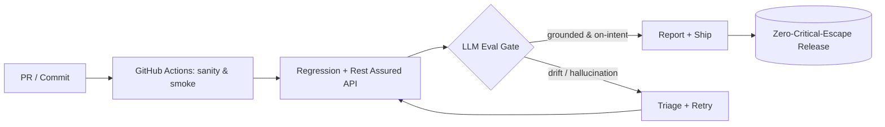

<!--
═══════════════════════════════════════════════════════════════════════════
  ATUL PATIL // GITHUB PROFILE README  —  "PROFESSIONAL" THEME (my recommendation)
  Drop this in a repo named EXACTLY  atulstack0  as  README.md
  ─────────────────────────────────────────────────────────────────────────
  Design goal: a hiring manager understands your value in ~10 seconds.
  Leads with the value proposition + metrics, then proof. Clean, scannable,
  still modern (one typing line, live stat cards, native Mermaid). The SNAKE
  image needs the one-time GitHub Action (see setup section).
═══════════════════════════════════════════════════════════════════════════
-->

# Hi, I'm Atul Patil 👋

I build **production-grade test infrastructure for AI/LLM-powered SaaS** — and I specialize in the part most QA teams haven't solved yet: **testing non-deterministic LLM features.**

---

### 📊 Impact at a glance

| | | | |
|:--|:--|:--|:--|
| **4+ yrs** in QA automation | **10 engineers** led | **40%** manual effort cut | **0** critical escapes |
| **50+** REST endpoints automated | **120+** language inputs validated | **9 modules** / 13 suites built | **🛡 Release Shield** award |

---

### 👨‍💻 About

I'm a **QA Lead & SDET at Chat360**, an AI-powered omnichannel SaaS platform in Pune. I lead a 10-engineer QA team and own test strategy, framework architecture, and sprint-level quality gates across product, engineering, and AI/ML teams.

- 🏗️ Architected a **Java + Selenium + TestNG + Maven** framework (Page Object Model) that **cut manual testing effort by 40%**
- 🔌 Built **Rest Assured** + Postman suites across **50+ REST endpoints** (WhatsApp Business API, CRM webhooks, payment callbacks) in Jenkins CI/CD
- 🤖 Pioneered **LLM evaluation** — intent classification, fallback logic & prompt-response integrity across **120+ language inputs**, with hallucination detection via DeepEval, Promptfoo & Giskard
- 🚀 Currently going deeper on **AI Quality Engineering** and a **Quality Architect** trajectory
- 💬 Open to **Senior SDET / AI Quality Engineer / QA Lead** roles

---

### 🛠️ Tech Stack

**Test Automation**

**API & Performance**

**CI/CD & Tooling**

**GenAI / LLM Quality** &nbsp;— *my differentiator*

**Languages**

---

### 📌 Featured Projects

| Project | What it does | Stack |
|:--|:--|:--|
| **[AutoApply](https://github.com/atulstack0/Automation)** — AI Job-Application Bot | Cascading AI engine (OpenAI → Gemini → Ollama → keyword fallback), multi-portal workers (Naukri, LinkedIn, Indeed), multi-ATS support, real-time dashboard with live KPIs | `Node.js` `Playwright` `Express` `Socket.io` `SQLite` `Ollama` |
| **[Chat360 Test Framework](https://github.com/atulstack0/Automation)** | Selenium 4 + Java 17 + TestNG + Maven on POM — 9 modules, 13 suites, Gmail-API OTP for 2FA, ExtentReports + Slack, RetryAnalyzer, GHA + Jenkins gates | `Java 17` `Selenium 4` `TestNG` `Rest Assured` |
| **LLM Chatbot Eval Suite** | Intent classification, fallback & prompt-integrity validation across 120+ language inputs with hallucination detection | `DeepEval` `Promptfoo` `Giskard` `Cucumber` |
| **API & Cross-Channel Suite** | 50+ REST endpoints (WhatsApp API, CRM webhooks, payment callbacks) with JSON-schema validation in nightly pipelines | `Rest Assured` `Postman` `Jenkins` |

---

### ⚙️ How I think about quality

---

### 📈 GitHub Stats

<!-- ╔═══ SNAKE — requires the GitHub Action in the setup section to populate ═══╗ -->

---

### 📫 Let's connect

I'm open to **Senior SDET, AI Quality Engineer, and QA Lead** opportunities.

[**LinkedIn**](https://www.linkedin.com/in/atulstack/) · [**Portfolio**](https://atulstack.netlify.app/) · [**Email**](mailto:atulstack@gmail.com) · [**X**](https://x.com/atulstack)

<i>"Catch Bugs, Not Feelings..."</i> — Pune, India 🇮🇳

