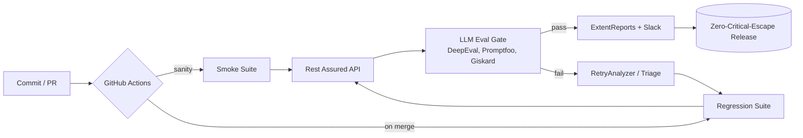

<!--
═══════════════════════════════════════════════════════════════════════════
  ATUL PATIL // GITHUB PROFILE README  —  "JARVIS / HUD" THEME
  Drop this in a repo named EXACTLY  atulstack0  as  README.md
  ─────────────────────────────────────────────────────────────────────────
  NOTE: GitHub strips JS/CSS, so the "animation" comes from live SVG services
  (typing, waves, stat cards, snake). All cards auto-update on their own.
  The SNAKE image needs the one-time GitHub Action setup (see bottom of file).
═══════════════════════════════════════════════════════════════════════════
-->

<!-- ╔═══ BOOT SEQUENCE ═══╗ -->
<div align="center">


</div>

<!-- ╔═══ HEADER WAVE ═══╗ -->


<div align="center">

`// SYS.PROFILE.v2 — STATUS: ONLINE // PUNE · IN · 18.52°N 73.85°E`

### ⚡ "Catch Bugs, Not Feelings..."

<a href="https://www.linkedin.com/in/atulstack/"></a>
<a href="https://github.com/atulstack0"></a>
<a href="https://atulstack.netlify.app/"></a>
<a href="https://x.com/atulstack"></a>
<a href="mailto:atulstack@gmail.com"></a>


<br/><br/>

<!-- ╔═══ SNAKE — sits under the name; needs the GitHub Action (see SETUP) to populate ═══╗ -->


</div>

---

## `// 01 — OPERATOR PROFILE`

```ansi
[36m> WHO IS BEHIND THE CONSOLE[0m
```

I'm a **QA Lead & SDET at Chat360**, an AI-powered omnichannel SaaS platform in Pune. I lead a **10-engineer QA team** — owning test strategy, framework architecture, and sprint-level quality gates across product, engineering, and AI/ML teams.

I architected a **Java + Selenium + TestNG + Maven** framework on the Page Object Model that **cut manual testing effort by 40%**, and built **Rest Assured** suites across **60+ REST endpoints** wired into Jenkins CI/CD nightly pipelines.

> **What sets me apart →** I test the *non-deterministic*. Traditional QA assumes a fixed expected output; LLM features don't play by those rules. I built evaluation strategies for a production NLP chatbot engine — **intent classification, fallback logic & prompt-response integrity across 120+ language inputs** — plus hallucination detection with **DeepEval, Promptfoo & Giskard**. Zero-critical-escape releases.

<table>
<tr><td><b>ROLE</b></td><td>QA Lead / SDET</td><td><b>EXP</b></td><td>4+ Years</td></tr>
<tr><td><b>COMPANY</b></td><td>Chat360</td><td><b>EDU</b></td><td>MCA · B.Sc CS</td></tr>
<tr><td><b>BASE</b></td><td>Pune, MH · India</td><td><b>TARGET</b></td><td>Senior SDET / AI Quality Engineer</td></tr>
</table>

---

## `// 02 — SKILL MATRIX`

**`> automation.core`**


**`> api.and.ci_cd`**


**`> genai.llm.qa`** &nbsp;`◂ the differentiator`

<kbd> LLM Evaluation </kbd> <kbd> DeepEval </kbd> <kbd> Promptfoo </kbd> <kbd> Giskard </kbd> <kbd> Hallucination Detection </kbd> <kbd> Intent Classification </kbd> <kbd> Prompt Regression </kbd> <kbd> Groundedness Scoring </kbd>


**`> languages.and.tools`**


---

## `// 03 — QUALITY PIPELINE` &nbsp;`[ live diagram ]`



---

## `// 04 — DEPLOYED SYSTEMS`

<details open>
<summary><b>▸ PRJ_001 — AutoApply // AI Job-Application Bot</b></summary>

> Full-stack automation platform with a **cascading AI engine** (OpenAI → Gemini → Ollama → keyword fallback), multi-portal workers for **Naukri, LinkedIn, Indeed & company pages**, multi-ATS support (Workday, Greenhouse, Lever), AI job scoring, and a real-time Express + Socket.io dashboard with live KPIs, logs & screenshots. Handles CAPTCHA, OTP, multi-step forms with anti-detection and exponential-backoff retries.
>
> `Node.js` `Playwright` `Express` `Socket.io` `SQLite` `Ollama LLM`

</details>

<details>
<summary><b>▸ PRJ_002 — Chat360 Test Automation Framework</b></summary>

> **Selenium 4 + Java 17 + TestNG + Maven** on the Page Object Model — **9 modules, 8 page objects, 13 suites** (login, campaigns, templates, live chat, webhooks, WhatsApp). Rest-Assured API tests with **Gmail API OTP extraction** for 2FA, ExtentReports dashboards with Slack summaries, Log4j2, a flaky-test RetryAnalyzer, and GitHub Actions + Jenkins gates on every PR.
>
> `Java 17` `Selenium 4` `TestNG` `Maven` `Rest Assured` `ExtentReports`
>
> [↗ SOURCE](https://github.com/atulstack0/Automation)

</details>

<details>
<summary><b>▸ PRJ_003 — LLM Chatbot Evaluation Suite</b></summary>

> AI/ML feature validation for Chat360's LLM-powered NLP chatbot engine — intent classification, fallback logic, prompt-response integrity, and edge-case handling **across 120+ language inputs**, with hallucination detection via DeepEval, Promptfoo & Giskard.
>
> `DeepEval` `Promptfoo` `Giskard` `Cucumber` `Prompt Testing`

</details>

<details>
<summary><b>▸ PRJ_004 — API & Cross-Channel Suite</b></summary>

> Rest Assured & Postman suites covering **50+ REST endpoints** — WhatsApp Business API, CRM webhooks & payment callbacks — with JSON schema + status-code validation. Cross-channel Selenium testing across WhatsApp, Instagram, Messenger & web in nightly Jenkins pipelines.
>
> `Rest Assured` `Postman` `WhatsApp API` `Webhooks` `Jenkins`

</details>

---

## `// 05 — TELEMETRY`

<div align="center">


</div>

---

## `// 06 — MISSION LOG`

```
[ JAN 2025 — PRESENT ]  QA LEAD & SDET · Chat360 · Pune
  └─ Architected Java/Selenium/TestNG/Maven framework (POM + PageFactory) → manual effort -40%
  └─ Spearheaded LLM-chatbot validation across 120+ language inputs (BDD Cucumber)
  └─ Built Rest Assured + Postman suites for 50+ REST endpoints in Jenkins nightly pipelines

[ MAY 2022 — JAN 2025 ]  SOFTWARE TESTER · MiM-Essay · Delhi
  └─ Manual + automation across 4 products within structured SDLC/STLC
  └─ Selenium / Playwright / TestNG + Postman/SOAP UI → efficiency +30%, exec time -25%
  └─ Cross-browser verification: Chrome, Firefox, Safari, Edge × Windows/macOS/Android

[ 2016 — 2023 ]  MCA · B.Sc COMPUTER SCIENCE
  └─ Dr. B.A.M. University (Aurangabad) · North Maharashtra University (Jalgaon)

[ AWARD ]  🛡  RELEASE SHIELD — zero critical defect escapes across Chat360 releases
```

---

## `// TRANSMISSION`

<div align="center">

**Available for Senior QA / SDET / AI Quality Engineer roles.**
Let's talk automation architecture, quality at scale, or testing the AI frontier.

<a href="mailto:atulstack@gmail.com"></a>


`// ATUL PATIL © 2026 · PUNE, IN · BUILT IN THE NEW ERA`

</div>
